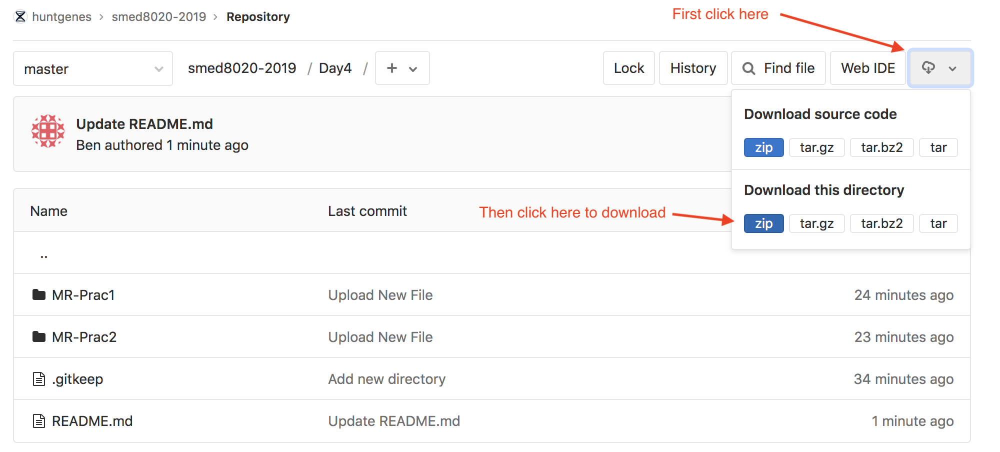

# DAY 4 - MR Practicals

## Description of the practicals

The MR practicals are in two parts: 
1) one-sample anlaysis (MR-Prac1)
2) two-sample analysis (MR-Prac2)

Each folder (MR-Prac*) cotains the following:
- tutorial (.docx, please download and open in WORD)
- R script for running the analysis (.R, please download and open in R studio)
- data files (.txt, please download these, they will be loaded into R using the R script in R Studio)

## Before you start:

You will need to download and install the following in order:
1) R version 4.0.0
https://cran.uib.no/
2) RStudio
https://www.rstudio.com/products/rstudio/download/
3) Download the practical
https://github.com/hunt-genes/PPU-GenEpi/

Please follow the instructions below to download the practical.
Clever clogs can use the 'git clone' command from the command line 

Please ask the tutors for help if you have trouble installing R, RStudio or downloading the practical 

